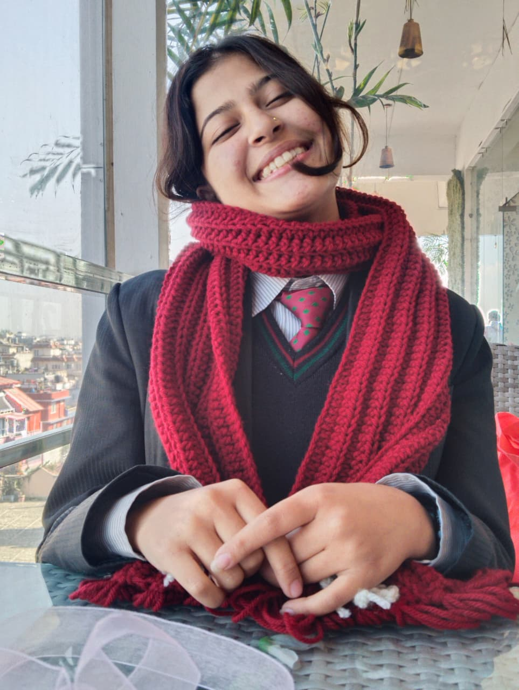
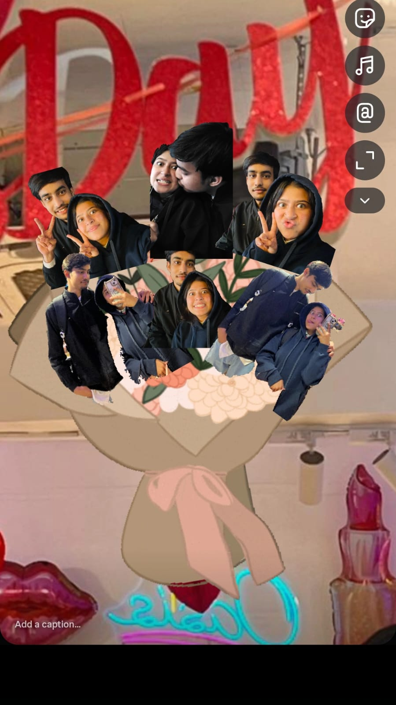
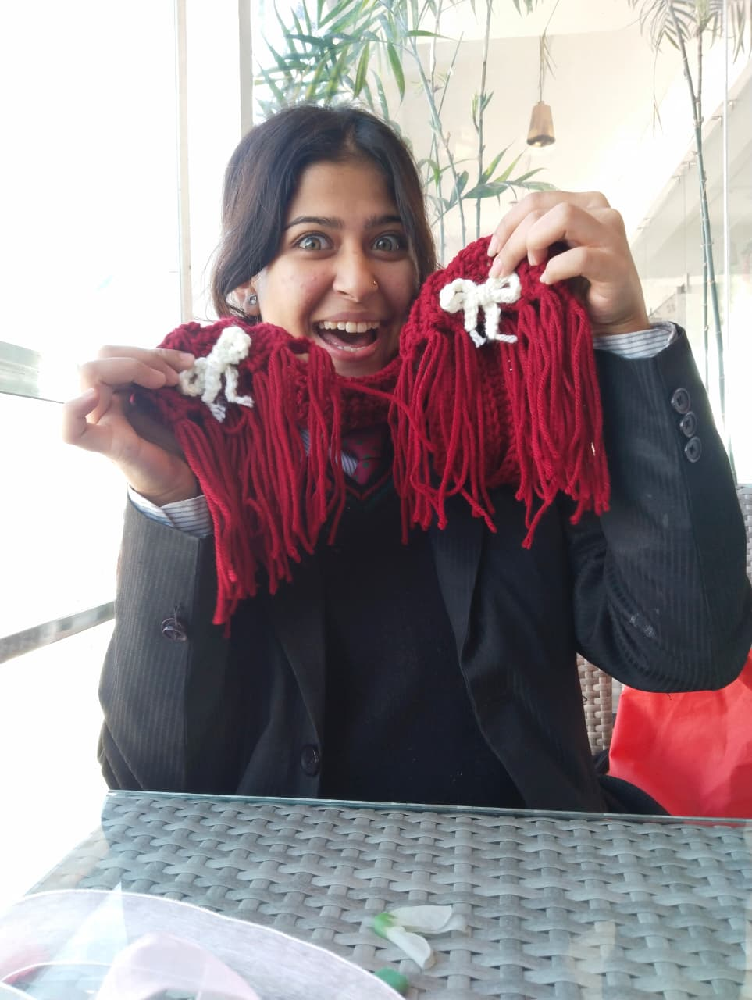

<html lang="en">
<head>
<meta charset="UTF-8">
<meta name="viewport" content="width=device-width, initial-scale=1.0">
<title>For My Love ❤️</title>

</head>
<body>

    
BANDANA(Panda/Fucchi) ❤️ My Love❤️😗

    

        
    

    <h2>I Miss You So Much 🤍</h2>

    <!-- Main Slider -->
    

        
Every day without you feels incomplete. I miss your voice, your smile, and the comfort you bring into my life.

        
I keep thinking about our memories, replaying them in my mind, wishing I could pause those beautiful moments forever.

        
I know this week might feel uncomfortable for you. I truly wish I could be beside you, just to gently hold you.

        
I miss hugging you so badly. I just want to wrap my arms around you and let you rest peacefully.

        
Every single day without you feels a little incomplete. I miss the way you smile, the way your voice makes everything feel calm, and the way even simple moments become special when you are around.

    

    <!-- Surprise Section -->
    

        <h2>You Are My Safe Place</h2>
        

            I know this week might feel uncomfortable for you. If you feel okay, can we meet this week? I don’t want anything except to gently hold you, let you rest peacefully in my arms, and make you feel safe and cared for 🤍 
            I'm always with you mero baccha ❤️😗 
            Don’t worry about anything. I’m right here if you need me 🤍 My arms will always be open to give you a warm hug that makes you feel safe and cared🫂❤️ 
            That's my real love language for you ❤️
        

        <button id="surpriseBtn">Click For Hidden Messages 💌💕</button>
        

            You are safe with me 🤍 
            You don’t have to be strong all the time 🌸 
            Let me protect your peace 🌙 
            Your comfort matters to me most ❤️
        

    

    <h2>📖 Our Story</h2>
    

        From the very first moment we connected, something felt truly special.
        You became my comfort, my peace, and my happiness in ways I never imagined.
        Every memory with you is precious—every laugh, every quiet moment, every silly conversation we shared.
        Even the simplest things, like talking about our day or just being near each other, make my heart feel full.
        You are not just part of my life — you are the most beautiful part of it.
        Being with you makes the world brighter, and even when we are apart, your presence stays with me, gently guiding me through every day.
        I cherish every moment we’ve shared, and I look forward to creating countless more memories together.
    

    <h3>📸 Our Memories</h3>
    

        
        
        
        
        
        
    

    <h3>🎥 Our Moments</h3>
    <video controls src="video1.mp4"></video>
    <video controls src="video2.mp4"></video>
    <video controls src="video3.mp4"></video>

    <button onclick="showPopup()">Click For A Message 💌</button>
    

    

        Waiting to hug you... ⏳
        

    

<!-- Popup -->

  

    <h3>Can We Meet This Week? 🤍</h3>
    

      I want to tell you something from my heart. Can we meet this week? Even for a short while? I just want to gently hold you and let you rest peacefully. Only if you feel comfortable. Your comfort matters most to me. 🤍
    

    <button id="yesBtn">Yes ❤️</button>
    <button id="noBtn">No ❌</button>
  

</body>
</html>

